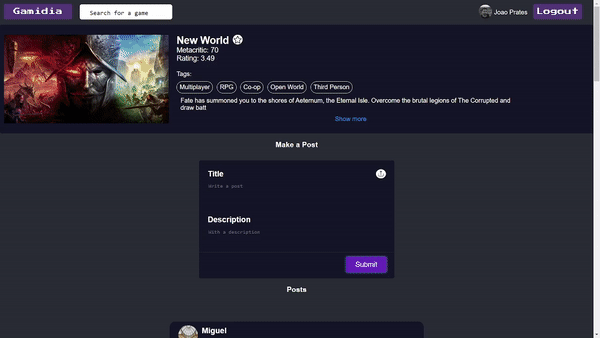

# Gamedia
## Front End

<p align="center">

</p>
<!-- PROJECT LOGO -->


<br />


<!-- ABOUT THE PROJECT -->
## Description

For this project I created a full-stack application using MERN Stack.
Gamedia is a social media web application made to connect all gamers though a variety of communities by allowing them to share experiences through posts.


## Back End
The back-end portion of this project can be found at the following link:
<a href="https://github.com/JayPrates/gamedia-server"> 
<br />  
gamedia-server </a>


### Built With

This section should list any major frameworks/libraries used to bootstrap your project. Leave any add-ons/plugins for the acknowledgements section. Here are a few examples.

* [React.js](https://reactjs.org/)
* [Bootstrap](https://getbootstrap.com)
* [Axios](https://www.npmjs.com/package/axios)
* [react-reveal](https://www.react-reveal.com/)


<p align="right">(<a href="#top">back to top</a>)</p>


### Live Demo

This is an example of how to list things you need to use the software and how to install them.
* npm
  ```sh
  npm install npm@latest -g
  ```

## Functionalities


<!-- CONTACT -->
## Contact

João Prates - joaoprates.az@gmail.com

Project Link: [https://github.com/JayPrates/gamedia-client](https://github.com/JayPrates/gamedia-client)

<p align="right">(<a href="#top">back to top</a>)</p>


<!-- ACKNOWLEDGMENTS -->
## Acknowledgments

* [React Infinite Scroll by Son Goku](https://dev.to/hunterjsbit/react-infinite-scroll-in-few-lines-588f)


<p align="right">(<a href="#top">back to top</a>)</p>


